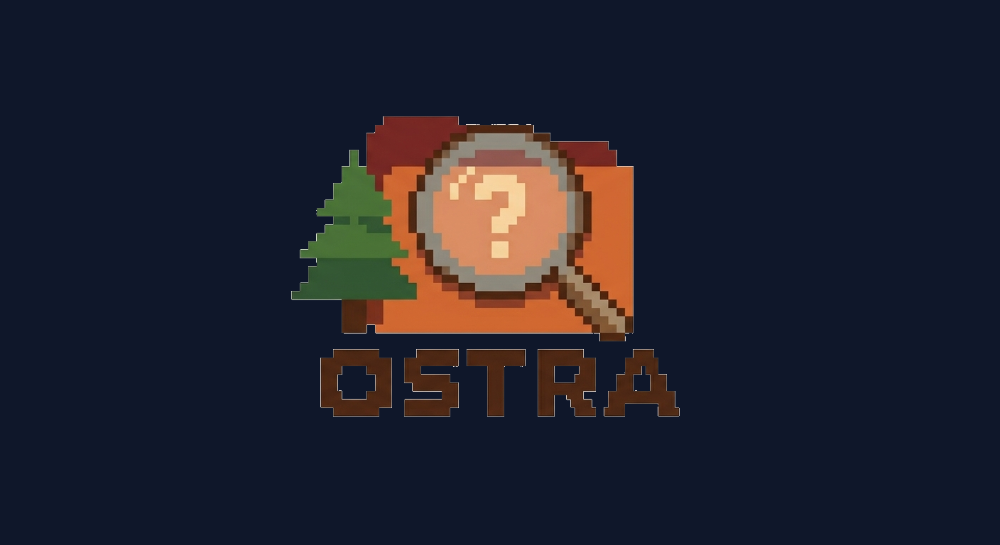

<p align="center">
  
</p>

<h1 align="center">OSTRA</h1>
<p align="center"><em>Open Source Threat Modeling &amp; Risk Analysis</em></p>
<p align="center">
  
  
  
  
  
  
  
</p>

---

OSTRA is a fully client-side threat modeling and risk analysis workbench that runs directly in the browser with no installation, no login, and no data leaving your machine. It covers the full cycle from architecture diagrams to STRIDE threat identification, attack tree analysis, CVSS 4.0 risk scoring, and structured risk assessment & control documentation.

---

## ✨ Features

### 🗺️ Threat Model

An interactive SVG-based data flow diagram editor with three view modes accessible via sub-tabs.

#### 📊 Data Flow Diagram (DFD)

- **6 element types:** Process (circle) · Data Store (rectangle with lines) · External Entity (double-border rectangle) · Database (cylinder) · Actor (stick figure) · Trust Zone (dashed area)
- **Data flows** with direction: Forward / Backward / Bidirectional — arrow heads rendered correctly at element boundaries
- **CIA classification** per element and per data flow, each dimension with a separate justification text field
- **Per-element properties:** annotation, authentication method, interfaces, services, encryption at rest (algorithm selectable)
- **Multi-select** — Ctrl+click (or Cmd+click on macOS) to select multiple elements; drag moves all selected items together
- **Double-click** any element to jump to its Name field in the Properties panel
- **Pan** by dragging empty canvas or middle mouse button; **Zoom** with the scroll wheel; **Reset view** with the ⌂ button
- **⚡ Identify Threats** — runs automatic STRIDE analysis across all elements and creates threat cards in the Threats tab
- **Export Model** — downloads the diagram as an SVG vector graphic

**Keyboard shortcuts** (focus must be on canvas, not an input field):

| Key | Action |
|-----|--------|
| `V` | Select / Move tool |
| `P` | Process tool |
| `S` | Data Store tool |
| `E` | External Entity tool |
| `C` | Database (Cylinder) tool |
| `A` | Actor tool |
| `F` | Data Flow tool |
| `T` | Trust Zone tool |
| `Del` / `Backspace` | Delete selected elements |
| `Escape` | Clear selection / cancel operation |

**FDA / Safety properties** (set per element in the Properties panel, used by the sub-views below):

| Property | Values | Purpose |
|----------|--------|---------|
| Direct Patient Harm | ✓ / — | Marks components whose compromise can directly harm patients |
| Attack Entry Point | ✓ / — | Marks externally reachable components (entry vectors) |
| Patchability | Unknown / Yes / Partial / No | Can a security patch be applied? |
| Updateability | Unknown / Yes / Partial / No | Can the component be updated in the field? |

#### 🏥 Multi-Patient Harm View (FDA)

Read-only overlay of the same diagram rendered with safety-focused color coding — required for FDA medical device cybersecurity submissions (per FDA guidance on multi-patient harm):

- 🔴 **Red** — components marked *Direct Patient Harm*
- 🔵 **Blue** — components marked *Attack Entry Point*
- ⬜ **Grey** — all other components

Connections are shown as grey arrows. A `⚠ Direct Harm` or `⤵ Entry Point` label floats above each classified component.

#### 🔧 Patchability & Updateability View

Read-only overlay showing field-update capability of each component — relevant to FDA post-market cybersecurity management:

- 🟢 **Green** — Patchability = Yes **and** Updateability = Yes
- 🟠 **Orange** — either value is Partial
- 🔴 **Red** — either value is No
- ⬜ **Grey** — Unknown (default)

A `P:Y U:P` style badge below each component shows the first letter of each value.

---

### 📦 Assets

Centralised registry of all assets in scope.

- **Auto-populated** from all diagram elements (processes, stores, external entities, databases, actors, data flows)
- **Manual assets** — click **＋ Add Asset** to add assets that are not represented in the diagram (name, type, CIA classification, justification); manual assets show a *(manual)* label and a delete button
- **Reorder** assets with ↑ / ↓ buttons; order is preserved across saves
- **Filter** by element type; **search** by name or ID
- **CSV export** of the full asset list including CIA ratings, justification, and linked threat count

---

### 🛡️ Threats

Threat cards created by STRIDE analysis or added manually.

- **⚡ Identify Threats** imports threats from the diagram automatically (one card per STRIDE category per applicable element)
- **＋ Add Manual** creates a free-standing threat card
- Each card carries: name, category (STRIDE), description, affected asset, status, CVSS 4.0 score, privacy impact, safety impact, security controls, residual risk, control reference, notes
- **Status:** Open · In Progress · Mitigated · Accepted · **No Threat**
  - *No Threat* items are hidden from the main list and archived in a collapsible bin — they remain visible in counters until explicitly deleted
- **CVSS 4.0 live scoring** — all 11 metrics, score and qualitative rating update in real time
- **Attack Tree link** — each card shows whether a linked attack tree exists (🌲) or can be created (🌲+)
- **Adverse Impact profile** — apply a named profile to auto-populate privacy impact, safety impact, and CIA fields in one click

---

### ⚠️ Adverse Impact

Reusable impact profiles for rapid risk classification.

- Define named profiles with **CIA ratings**, **privacy impact**, and **safety impact** values
- Apply any profile to a threat card with one click — all impact fields are populated automatically
- Profiles are saved with the project and can be reused across multiple threats

---

### 🌲 Attack Trees

Visual attack tree analysis with ISO/IEC 18045:2023 CEM attack potential scoring.

- **Create trees** from scratch or directly from a threat card (🌲+ button)
- **AND / OR gates** — OR gates indicate any child path suffices; AND gates require all child paths
- **CEM Attack Potential** — each node is scored across five factors:

| Factor | Description |
|--------|-------------|
| Elapsed Time | Time needed to carry out the attack |
| Expertise | Level of knowledge required |
| Knowledge | Knowledge of the target system |
| Opportunity | Window of opportunity (access) |
| Equipment | Equipment required |

Combined score maps to an attack potential level:

| Score | Level | Probability |
|-------|-------|-------------|
| 0–9 | Basic | 90 % |
| 10–13 | Enhanced-Basic | 70 % |
| 14–19 | Moderate | 50 % |
| 20–24 | High | 25 % |
| ≥ 25 | Beyond High | 10 % |

- **Tree risk score** = attack probability × impact (0–10)
- **Critical path** highlighted in red — follows the branch with the **lowest attack potential score** at each OR node (the easiest path an attacker with minimal resources can take); all branches of AND nodes are critical
- **Countermeasure** flag per node with configurable effectiveness (%) that reduces the node's probability
- Link a tree to a threat in the Threats tab; the AT Risk column in the RAC table reflects the linked tree's risk score

---

### 📋 Risk Assessment & Control (RAC)

Structured tabular documentation of vulnerabilities and weaknesses — designed to support IEC 62443, EN 18031, and FDA cybersecurity submissions.

- **Two entry types:** Vulnerability (V-) and Weakness (W-)
- **Import from Threats** — pre-populates identification, asset, CVSS, and impact fields from a linked threat card; threat reference can be changed later with optional re-import
- **33 columns** across four groups:

| Group | Key Fields |
|-------|------------|
| Identification | ID, type, short description, affected component, component origin, initial rating |
| Risk Assessment | CVSS 4.0 (all 11 metrics), AT Risk (from linked attack tree), privacy impact, safety impact, rationale for applicability |
| Control | Security controls, control reference |
| Residual Risk | Residual CVSS 4.0 (separate scoring), residual privacy/safety impact, residual risk rating, status |

- **Live CVSS calculation** for both initial and residual scoring — vector string updates in real time
- **AT Risk badge** — shows the risk score from the linked attack tree directly in the table
- **Status:** Open · In Progress · Mitigated · Accepted

---

### ⚙️ Settings

- **Night Mode** — full dark theme toggle (persisted across sessions)
- **Audit Log** — timestamped record of significant actions (project save/load, exports)

---

### 📄 Export & Project Management

| Action | Description |
|--------|-------------|
| 📄 **New** | Create a new empty project; prompts to save if unsaved changes exist |
| 💾 **Save As** | Download the full project state as a `.json` file |
| 📂 **Open** | Load a previously saved `.json` project file |
| 📐 **Export Model** | Download the DFD diagram as an `.svg` vector graphic |
| **Export XML** | Download a full vulnerability report with CVSS vectors (in Threats tab) |

All data is stored in the **browser's `localStorage`** and never sent anywhere. Use *Save As* to create a portable `.json` backup.

---

## 🚀 Getting Started

### Option 1 — Open directly (no server needed)

```bash
open index.html          # macOS
start index.html         # Windows
xdg-open index.html      # Linux
```

No installation, no build step, no dependencies.

### Option 2 — Serve with Node.js (optional)

Useful when accessing OSTRA over a network or to avoid browser file-protocol restrictions on some browsers.

```bash
npm install      # installs Express (only dependency)
npm start        # serves at http://localhost:3000
```

Set a custom port with `PORT=8080 node server.js`.

### Building TypeScript (optional, for contributors)

The compiled JavaScript in `js/` is committed alongside the TypeScript source in `src/`.
If you modify the TypeScript source, recompile with:

```bash
npm install          # installs TypeScript dev dependency
npm run build        # compile once
npm run watch        # watch mode
```

---

## 🗂️ Project Structure

```
ostra/
├── src/                      # TypeScript source (source of truth)
│   ├── types.ts              # Shared interfaces and type declarations
│   ├── storage.ts            # localStorage persistence + ID counters
│   ├── cvss4.ts              # CVSS 4.0 scoring engine
│   ├── diagram.ts            # SVG diagram editor (DFD + sub-views)
│   ├── adversal.ts           # Adverse Impact module
│   ├── assets.ts             # Asset registry (auto + manual)
│   ├── threats.ts            # STRIDE threat identification
│   ├── vulnmgmt.ts           # Threats tab (risk cards)
│   ├── attacktrees.ts        # Attack Trees (CEM scoring, layout)
│   ├── racassessment.ts      # Risk Assessment & Control table
│   ├── report.ts             # XML export
│   ├── audit.ts              # Audit log
│   ├── settings.ts           # Settings UI
│   └── app.ts                # App controller (routing, save/load)
├── js/                       # Compiled JavaScript (generated from src/)
├── css/
│   └── style.css             # All styles including night mode
├── images/
│   └── OSTRA.png             # Application logo
├── index.html                # Single-page application (open directly)
├── server.js                 # Optional Express static server
├── tsconfig.json             # TypeScript compiler configuration
└── package.json
```

---

## 🔐 STRIDE Threat Matrix

| Element Type   |  S  |  T  |  R  |  I  |  D  |  E  |
|----------------|:---:|:---:|:---:|:---:|:---:|:---:|
| Process        | ✅  | ✅  | ✅  | ✅  | ✅  | ✅  |
| Data Store     |     | ✅  |     | ✅  | ✅  |     |
| Data Flow      |     | ✅  |     | ✅  | ✅  |     |
| Trust Boundary | ✅  | ✅  | ✅  | ✅  | ✅  | ✅  |

**S** Spoofing · **T** Tampering · **R** Repudiation · **I** Information Disclosure · **D** Denial of Service · **E** Elevation of Privilege

---

## 📊 CVSS 4.0 Metrics

| Group             | Metric                   | Values                                |
|-------------------|--------------------------|---------------------------------------|
| Exploitability    | Attack Vector (AV)       | Network · Adjacent · Local · Physical |
| Exploitability    | Attack Complexity (AC)   | Low · High                            |
| Exploitability    | Attack Requirements (AT) | None · Present                        |
| Exploitability    | Privileges Required (PR) | None · Low · High                     |
| Exploitability    | User Interaction (UI)    | None · Passive · Active               |
| Vulnerable System | Confidentiality (VC)     | None · Low · High                     |
| Vulnerable System | Integrity (VI)           | None · Low · High                     |
| Vulnerable System | Availability (VA)        | None · Low · High                     |
| Subsequent System | Confidentiality (SC)     | None · Low · High                     |
| Subsequent System | Integrity (SI)           | None · Low · High · Safety            |
| Subsequent System | Availability (SA)        | None · Low · High · Safety            |

Used for both initial risk scoring and residual risk scoring (separate metric sets).

---

## 🛠️ Tech Stack

| Layer     | Technology                                          |
|-----------|-----------------------------------------------------|
| Frontend  | TypeScript 5 → compiled Vanilla JS (no framework)  |
| Diagrams  | Custom SVG editor (zero external dependencies)      |
| Server    | Node.js + Express (optional, for network access)    |
| Storage   | Browser localStorage + JSON project export          |
| License   | Apache 2.0                                          |

---

## 📜 License

Apache License 2.0 — see [LICENSE](LICENSE) for details.

---

## 🤝 Contributing

Pull requests welcome. Please open an issue first to discuss what you would like to change.
